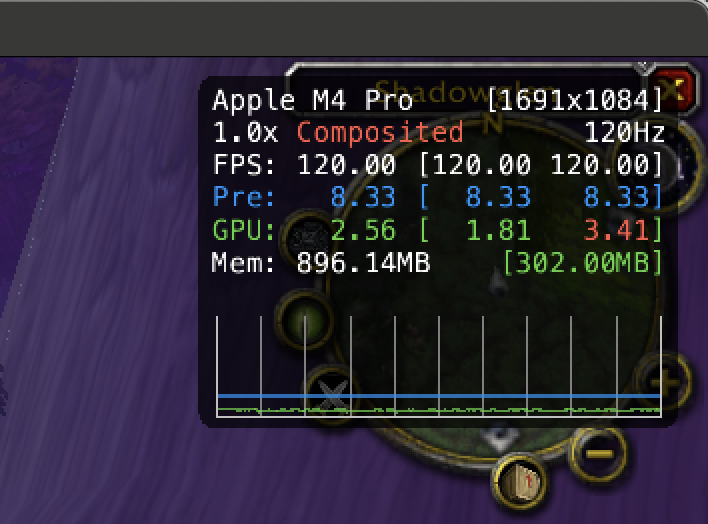
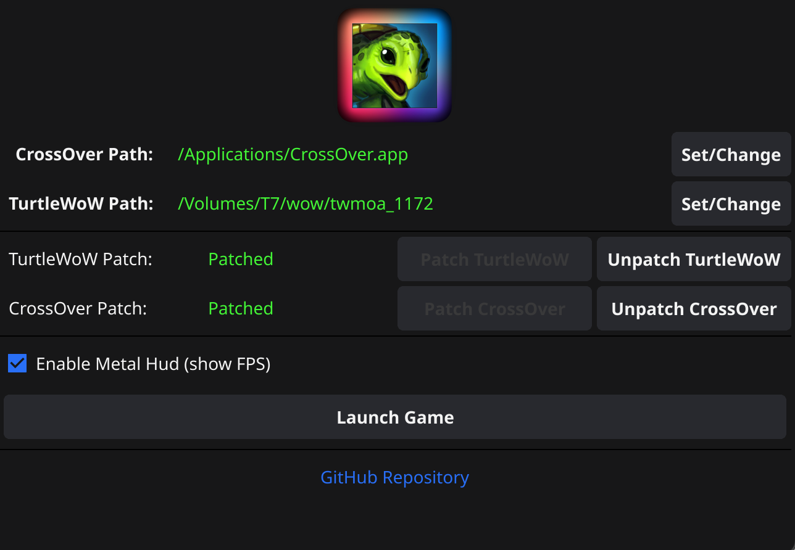

# TurtleSilicon 

<div align="center">


</div>

A user-friendly launcher for Turtle WoW on Apple Silicon Macs, with one-click patching of winerosetta, rosettax87 and d9vk.

## Prerequisites

Before you begin, ensure you have the following:

*   A working version of **CrossOver** installed (the trial version is sufficient).
*   The **Turtle WoW Client** downloaded from the official website.

## Credits

All credit for the core translation layer `winerosetta` goes to **LifeisAwful**. This application is merely a Fyne-based GUI wrapper to simplify the patching and launching process. [https://github.com/Lifeisawful/winerosetta](https://github.com/Lifeisawful/winerosetta) 

## Features & Highlights

*   💻 **Run 32-bit DirectX9 World of Warcraft (v1.12) on Apple Silicon:** Enjoy the classic WoW experience on your modern Mac without "illegal instruction" errors.
*   🚀 **Significant Performance Boost:**
    *   Utilizes the `rosettax87` hack by LifeisAwful to accelerate x87 FPU instructions.
    *   Integrates `d9vk` (a fork of DXVK for MoltenVK) by Kegworks-App, enabling DirectX9 to run much more efficiently on Apple Silicon via Vulkan and Metal.
    *   Experience a massive FPS increase: from around 20 FPS in unoptimized environments to **up to 200 FPS** (a 10x improvement!) in many areas.
*   🖱️ **One-Click Patching:** Simplifies the setup process for both CrossOver and your Turtle WoW installation.
*   🎨 **User-Friendly Interface:** Easy-to-use GUI built with Fyne.

## Usage

### Method 1: Using the Pre-built Application

1.  Launch `TurtleSilicon.app`.
2.  **Set CrossOver Path**:
    *   If CrossOver is installed in the default location (`/Applications/CrossOver.app`), this path will be pre-filled.
    *   Otherwise, click "Set/Change" and navigate to your `CrossOver.app` bundle.
3.  **Set TurtleWoW Directory Path**:
    *   Click "Set/Change" and select the folder where you have your Turtle WoW client files.
4.  **Apply Patches**:
    *   Click "Patch TurtleWoW".
    *   Click "Patch CrossOver".
    *   Status indicators will turn green once patching is successful for each.
5.  **Launch Game**:
    *   Once both paths are set and both components are patched, the "Launch Game" button will become active. Click it.
    *   Follow the on-screen prompts (you will need to enter your password in a new Terminal window for `rosettax87`).
6.  **Enjoy**: Experience a significantly smoother Turtle WoW on your Apple Silicon Mac!

### Method 2: Running from Source Code

If you prefer to run the application directly from source code:

1.  **Clone the repository**:
    ```sh
    git clone https://github.com/tairasu/TurtleSilicon.git
    ```

2.  **Navigate to the directory**:
    ```sh
    cd TurtleSilicon
    ```

3.  **Run the application**:
    ```sh
    go run main.go
    ```
    
    Note: This method requires Go to be installed on your system. See the Build Instructions section for details on installing Go and Fyne.

4.  **Use the application** as described in Method 1 (steps 2-6).

## Build Instructions

To build this application yourself, you will need:

1.  **Go**: Make sure you have Go installed on your system. You can download it from [golang.org](https://golang.org/).
2.  **Fyne**: Install the Fyne toolkit and its dependencies by following the instructions on the [Fyne website](https://developer.fyne.io/started/).

Once Go and Fyne are set up, navigate to the project directory in your terminal and run the following command to build the application for Apple Silicon (ARM64) macOS:

```sh
GOOS=darwin GOARCH=arm64 fyne package
```

This will create a `TurtleSilicon.app` file in the project directory, which you can then run.

Make sure you have an `Icon.png` file in the root of the project directory before building.

## Bundled Binaries

The `rosettax87` and `winerosetta` (d3d9.dll) components included in this application are precompiled for convenience. If you prefer, you can compile them yourself by following the instructions provided by LifeIsAwful on the official `winerosetta` repository: [https://github.com/Lifeisawful/winerosetta](https://github.com/Lifeisawful/winerosetta)
