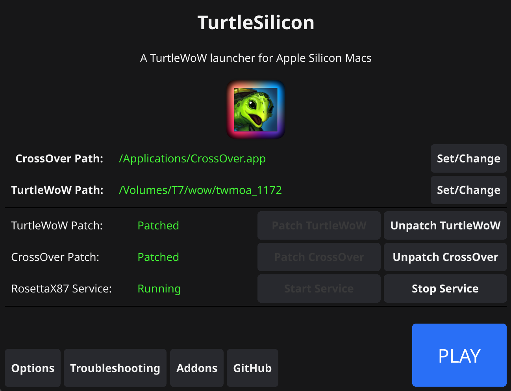

<h1 align="center"> TurtleSilicon</h1> 

<div align="center">
    
  <a href="">[](https://github.com/tairasu/TurtleSilicon/actions/workflows/build.yml)</a>
  <a href="">[]()</a>
  
</div>


<div align="center">


</div>

A powerful multi-version World of Warcraft launcher for Apple Silicon Macs, supporting Vanilla (1.12), TBC (2.4.3), WotLK (3.3.5), Turtle WoW, and Project Epoch. Features one-click patching, addon management, and performance optimization for all WoW versions.

## Supported Game Versions

TurtleSilicon now supports multiple World of Warcraft versions and private servers:

- **Turtle WoW** - Enhanced vanilla experience with custom content
- **Project Epoch** - Wrath of the Lich King (3.3.5a) server with automatic client setup
- **Vanilla WoW** - Classic 1.12.1 experience
- **Burning Crusade** - TBC 2.4.3 expansion
- **Wrath of the Lich King** - WotLK 3.3.5a expansion

Each version maintains separate settings, paths, and configurations for complete isolation.

## Prerequisites

Before you begin, ensure you have the following:

*   A working version of **CrossOver** installed (the trial version is sufficient and can still be used after expiration).
    - I recommend using CrossOver v25.0.1 or later. Older versions will cause issues.
*   The **World of Warcraft Client** for your desired version:
    - Turtle WoW: Download from the official Turtle WoW website
    - Project Epoch: Provide a WotLK 3.3.5a client (TurtleSilicon will download Project Epoch files)
    - Other versions: Provide your own legitimate WoW installation


## Features

### Performance & Compatibility
*   **Apple Silicon Native:** Runs all World of Warcraft versions on M1/M2/M3/M4 Macs without "illegal instruction" errors
*   **Advanced Performance Optimization:** 
    *   Integrates `rosettax87` for accelerated x87 FPU instructions
    *   Uses `d9vk` for efficient DirectX9 via Vulkan/Metal translation
    *   Optional `libSiliconPatch` for SSE2 instruction replacement (2x+ FPS boost - works only on TurtleWoW)
    *   Achieves significant FPS improvements (20 FPS → 200+ FPS in many scenarios)

### Multi-Version Support
*   **Version Management:** Switch between different WoW versions seamlessly
*   **Isolated Settings:** Each version maintains separate configurations, paths, and settings
*   **Version-Specific Features:** Tailored options for each WoW version (e.g., vanilla-tweaks for older versions)
*   **Dynamic UI:** Interface adapts based on selected version capabilities

### Addon Management
*   **Git Repository Support:** Automatic updates for addons hosted on GitHub/GitLab
*   **Bulk Operations:** Update all addons at once or manage them individually
*   **Easy Installation:** Add new addons directly from repository URLs
*   **Smart Detection:** Automatically detects git-managed addons in your Interface/Addons folder

### Advanced Configuration
*   **Graphics Settings:** Automated optimization for terrain distance, shadows, multisampling
*   **Environment Variables:** Custom environment variable support per version
*   **Wine Registry Management:** Option-as-Alt key remapping for Mac users
*   **Terminal Integration:** Optional terminal output for debugging

### Project Epoch Integration
*   **Automatic File Management:** Downloads and configures all required Project Epoch files for your existing WotLK 3.3.5a client
*   **File Validation:** Ensures all necessary Project Epoch components are present before launching
*   **Seamless Updates:** Automatic realmlist updates and Project Epoch file management

## Usage

### Getting Started

1.  **Launch TurtleSilicon.app**
     * (The app is not signed, so you may get a security warning. Open Terminal and run `xattr -cr /Applications/TurtleSilicon.app` to bypass it)

2.  **Select Your Game Version**
    *   Click on the large version title at the top to open the version selector
    *   Choose from Turtle WoW, Project Epoch, Vanilla, TBC, or WotLK
    *   Each version will have its own independent configuration

3.  **Set CrossOver Path**
    *   If CrossOver is installed in the default location (`/Applications/CrossOver.app`), this path will be pre-filled
    *   Otherwise, click "Set/Change" and navigate to your `CrossOver.app` bundle

4.  **Set Game Directory Path**
    *   Click "Set/Change" and select the folder containing your WoW client files
    *   For Project Epoch: Point to your WotLK 3.3.5a installation - TurtleSilicon will automatically download missing Project Epoch files

5.  **Apply Patches**
    *   Click "Patch Game" to apply performance optimizations
    *   Click "Patch CrossOver" to enable compatibility layers
    *   Status indicators will turn green once patching is successful

6.  **Configure Options (Optional)**
    *   Access the **Options** menu for detailed settings:
        - Enable version-specific features (e.g., vanilla-tweaks)
        - Configure graphics settings for optimal performance
        - Set up custom environment variables
        - Manage Wine registry settings

7.  **Manage Addons**
    *   Click **Addons** to open the addon manager
    *   Update existing git-based addons or install new ones from repositories
    *   Filter to show only git-managed addons for easy maintenance

8.  **Launch Game**
    *   Once everything is configured and patched, click the large **PLAY** button
    *   Enjoy your optimized World of Warcraft experience on Apple Silicon!

### Running from Source Code

If you prefer to run from source:

```sh
git clone https://github.com/tairasu/TurtleSilicon.git
cd TurtleSilicon
go run main.go
```

Note: Requires Go to be installed. See Build Instructions for details.

## Recommended Graphics Settings

TurtleSilicon includes automated graphics optimization, but you can also manually configure:

1. **Terrain Distance**: Set as low as possible to reduce CPU overhead
2. **Vertex Animation Shaders**: Enable to prevent graphic glitches on custom models
3. **Multisampling**: Set to 2x for proper portrait loading
4. **Shadow LOD**: Set to 0 for ~10% FPS improvement
5. **libSiliconPatch**: Enable for 2x+ FPS boost (TurtleSilicon only, may cause rare graphical issues)

Access these settings through the Options menu or use the "Apply recommended settings" button for automatic configuration.

## Build Instructions

### Prerequisites
1.  **Go**: Download from [golang.org](https://golang.org/)
2.  **Fyne**: Install following [Fyne documentation](https://developer.fyne.io/started/)

### Building

#### Option 1: Using Makefile (Recommended)
```sh
make
```

This automatically:
- Builds for Apple Silicon macOS
- Copies required resource files to the app bundle

#### Option 2: Manual Build
```sh
GOOS=darwin GOARCH=arm64 fyne package
cp -R rosettax87 winerosetta TurtleSilicon.app/Contents/Resources/
```

## Version-Specific Features

### Turtle WoW
- Full vanilla-tweaks integration
- Custom graphics optimizations

### Project Epoch
- Automatic Project Epoch file downloading for existing WotLK 3.3.5a clients
- File validation and updates

## Credits

All credit for the core translation layer `winerosetta` and `rosettax87` goes to [**@Lifeisawful**](https://github.com/Lifeisawful). This application is merely a Fyne-based GUI wrapper to simplify the patching and launching process. 

[https://github.com/Lifeisawful/winerosetta](https://github.com/Lifeisawful/winerosetta) 

[https://github.com/Lifeisawful/rosettax87](https://github.com/Lifeisawful/rosettax87)

## Bundled Binaries

The `rosettax87` and `winerosetta` components are precompiled for convenience. You can compile them yourself using:
- [winerosetta repository](https://github.com/Lifeisawful/winerosetta)
- [rosettax87 repository](https://github.com/Lifeisawful/rosettax87)

## License

This project is licensed under the MIT License.