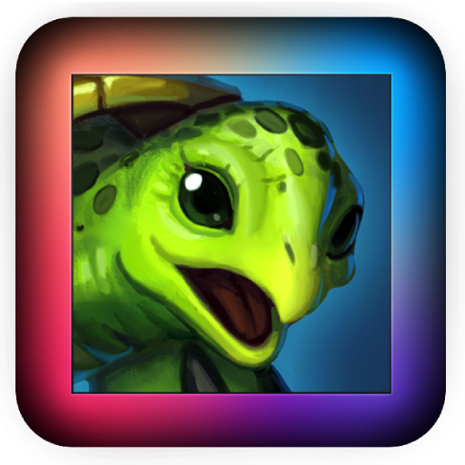
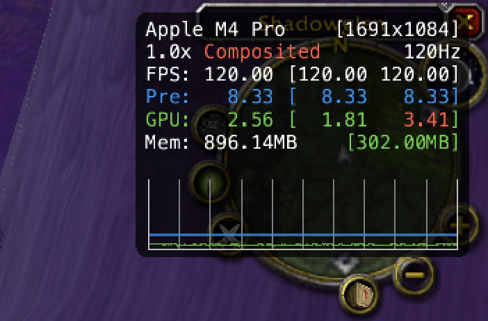

> [!CAUTION]
> **Currently not recommended for hardcore mode.** This method is unstable and the client can crash at any moment. The patches are in early development.

# TurtleSilicon 

<div align="center">


</div>

A user-friendly launcher for Turtle WoW on Apple Silicon Macs, with one-click patching of winerosetta, rosettax87 and d9vk.

## Prerequisites

Before you begin, ensure you have the following:

*   A working version of **CrossOver** installed (the trial version is sufficient).
*   The **Turtle WoW Client** downloaded from the official website.

## Credits

All credit for the core translation layer `winerosetta` and `rosettax87` goes to [**@Lifeisawful**](https://github.com/Lifeisawful). This application is merely a Fyne-based GUI wrapper to simplify the patching and launching process. 

[https://github.com/Lifeisawful/winerosetta](https://github.com/Lifeisawful/winerosetta) 

[https://github.com/Lifeisawful/rosettax87](https://github.com/Lifeisawful/rosettax87)

## Features & Highlights

*   💻 **Run 32-bit DirectX9 World of Warcraft (v1.12) on Apple Silicon:** Enjoy the classic WoW experience on your modern Mac without "illegal instruction" errors.
*   🚀 **Significant Performance Boost:**
    *   Utilizes the `rosettax87` hack by LifeisAwful to accelerate x87 FPU instructions.
    *   Integrates `d9vk` (a fork of DXVK for MoltenVK) by Kegworks-App, enabling DirectX9 to run much more efficiently on Apple Silicon via Vulkan and Metal.
    *   Experience a massive FPS increase: from around 20 FPS in unoptimized environments to **up to 200 FPS** (a 10x improvement!) in many areas.
*   🖱️ **One-Click Patching:** Simplifies the setup process for both CrossOver and your Turtle WoW installation.
*   🎨 **User-Friendly Interface:** Easy-to-use GUI built with Fyne.

## Usage

### Method 1: Using the Pre-built Application

1.  Launch `TurtleSilicon.app`.
     * (The app is not signed, so you will get a "this app is damaged" message. Open Terminal and enter `xattr -cr /Applications/TurtleSilicon.app` to bypass it)
3.  **Set CrossOver Path**:
    *   If CrossOver is installed in the default location (`/Applications/CrossOver.app`), this path will be pre-filled.
    *   Otherwise, click "Set/Change" and navigate to your `CrossOver.app` bundle.
4.  **Set TurtleWoW Directory Path**:
    *   Click "Set/Change" and select the folder where you have your Turtle WoW client files.
5.  **Apply Patches**:
    *   Click "Patch TurtleWoW".
    *   Click "Patch CrossOver".
    *   Status indicators will turn green once patching is successful for each.
6.  **Launch Game**:
    *   Once both paths are set and both components are patched, the "Launch Game" button will become active. Click it.
    *   Follow the on-screen prompts (you will need to enter your password in a new Terminal window for `rosettax87`).
7.  **Enjoy**: Experience a significantly smoother Turtle WoW on your Apple Silicon Mac!

### Method 2: Running from Source Code

If you prefer to run the application directly from source code:

1.  **Clone the repository**:
    ```sh
    git clone https://github.com/tairasu/TurtleSilicon.git
    ```

2.  **Navigate to the directory**:
    ```sh
    cd TurtleSilicon
    ```

3.  **Run the application**:
    ```sh
    go run main.go
    ```
    
    Note: This method requires Go to be installed on your system. See the Build Instructions section for details on installing Go and Fyne.

4.  **Use the application** as described in Method 1 (steps 2-6).

## Recommended settings

1. Set "Terrain distance" as low as possible. This reduces the overhead stress on the CPU
2. Turn VSync on. Too high fps causes the client to freeze.
   * Alternatively: Create a dxvk.conf file inside your TurtleWoW directory and enter `d3d9.maxFrameRate = 120`. Set it to a value of 180 or lower

## Build Instructions

To build this application yourself, you will need:

1.  **Go**: Make sure you have Go installed on your system. You can download it from [golang.org](https://golang.org/).
2.  **Fyne**: Install the Fyne toolkit and its dependencies by following the instructions on the [Fyne website](https://developer.fyne.io/started/).

Once Go and Fyne are set up, navigate to the project directory in your terminal and run the following command to build the application for Apple Silicon (ARM64) macOS:

### Option 1: Using the Makefile (Recommended)

The included Makefile automates the build process and handles copying the required resource files:

```sh
make
```

This will:
1. Build the application for Apple Silicon macOS
2. Automatically copy the rosettax87 and winerosetta directories to the app bundle

### Option 2: Manual Build

If you prefer to build manually:

```sh
GOOS=darwin GOARCH=arm64 fyne package
# Then manually copy the resource directories
cp -R rosettax87 winerosetta TurtleSilicon.app/Contents/Resources/
```

In either case, this will create a `TurtleSilicon.app` file in the project directory, which you can then run.

Make sure you have an `Icon.png` file in the root of the project directory before building.

## Bundled Binaries

The `rosettax87` and `winerosetta` components included in this application are precompiled for convenience. If you prefer, you can compile them yourself by following the instructions provided by Lifeisawful on the official repositories: 
[https://github.com/Lifeisawful/winerosetta](https://github.com/Lifeisawful/winerosetta)
[https://github.com/Lifeisawful/rosettax87](https://github.com/Lifeisawful/rosettax87)
